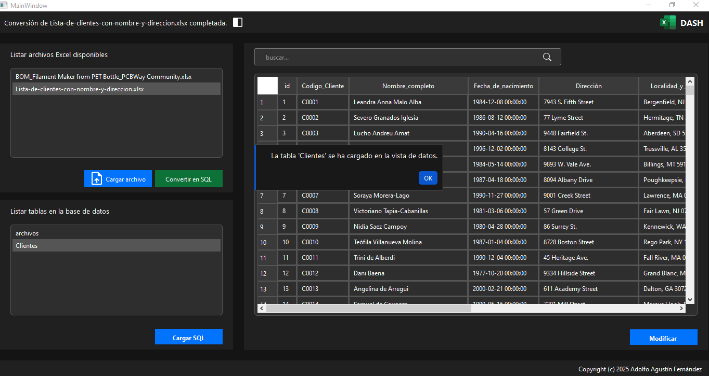

# Generación de Tablas SQL desde Archivos Excel

Este proyecto permite leer un archivo Excel, generar sentencias SQL para crear tablas en una base de datos SQLite y luego insertar los datos en dichas tablas.

## Captura de Pantalla de la Aplicación



Esta es una captura de pantalla de la aplicación en funcionamiento. Muestra la interfaz gráfica de usuario y algunas de las funcionalidades principales.

## Características

- **Lectura de Archivos Excel**: Utiliza `pandas` para leer archivos Excel.
- **Generación de Sentencias SQL**: Crea tablas y sentencias de inserción basadas en los datos del Excel.
- **Interacción con SQLite**: Maneja la conexión y ejecución de sentencias SQL en una base de datos SQLite.
- **Interfaz de Usuario**: Proporciona una interfaz gráfica para facilitar el uso del programa.

## Requisitos Previos

- **Python 3.8 o superior**.
- **pip** para instalar dependencias.

## Configuración del Proyecto

1. **Clonar el Repositorio**:
   ```bash
   git clone https://github.com/your_username/migrexel.git
   cd migrexel

2. **Crear un Entorno Virtual**:
   ```bash
   python -m venv venv
   venv\Scripts\activate

3. **Instalar Dependencias:**:
   pip install -r requirements.txt

4. **Ejecutar el Proyecto**:
Coloca tu archivo Excel en la carpeta archivos_xls/.
Asegúrate de que el nombre del archivo coincida con el especificado en main.py (por defecto, datos.xlsx).
Ejecuta el script principal:
bash
python main.py
Esto leerá el archivo Excel, generará las sentencias SQL para crear la tabla en una base de datos SQLite (mi_base_de_datos.db) e insertará los datos.

## Módulos del Proyecto
   **excel_reader.py**: Lee un archivo Excel y devuelve un DataFrame de pandas.
   **sql_generator.py**: Genera sentencias SQL para crear tablas e insertar datos.
   **database.py**: Maneja la conexión y ejecución de sentencias SQL en SQLite.
   **main.py**: Orquesta el proceso completo.

## Personalización
Tipos de Datos: Modifica la función generate_create_table_sql en sql_generator.py para detectar automáticamente el tipo de dato de cada columna.
Nombre de la Tabla: Cambia el valor de table_name en main.py para usar un nombre de tabla diferente.
Archivo Excel: Coloca tu archivo Excel en la carpeta archivos_xls/ y actualiza la ruta en main.py.
Licencia
Este proyecto está bajo la licencia MIT. Consulta el archivo LICENSE para más detalles.

## Instrucciones Adicionales

- **Generación de Archivos UI**: Si realizas cambios en `main_windows_ui.ui`, ejecuta:
  ```bash
  pyside6-uic main_windows_ui.ui -o ui_main_window.py

- **Generación de Recursos**: Si realizas cambios en resource.qrc, ejecuta:
   ```bash
   pyside6-rcc resource.qrc -o resource_rc.py

## Contribución
Si deseas contribuir al proyecto, por favor, abre un issue o envía un pull request.

## Contacto
Si tienes alguna pregunta o sugerencia, no dudes en contactarme.